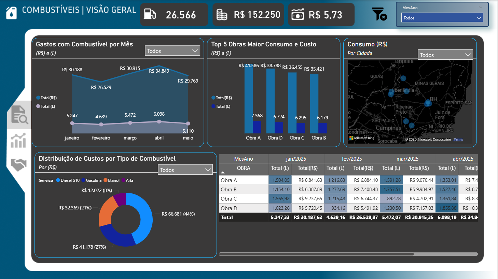
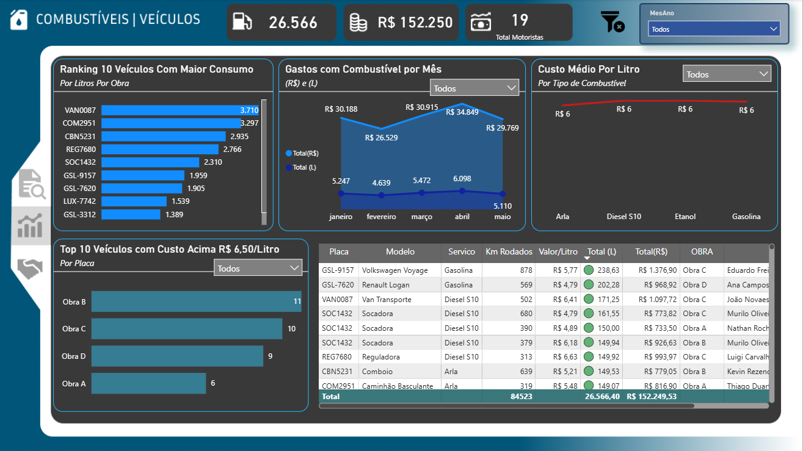
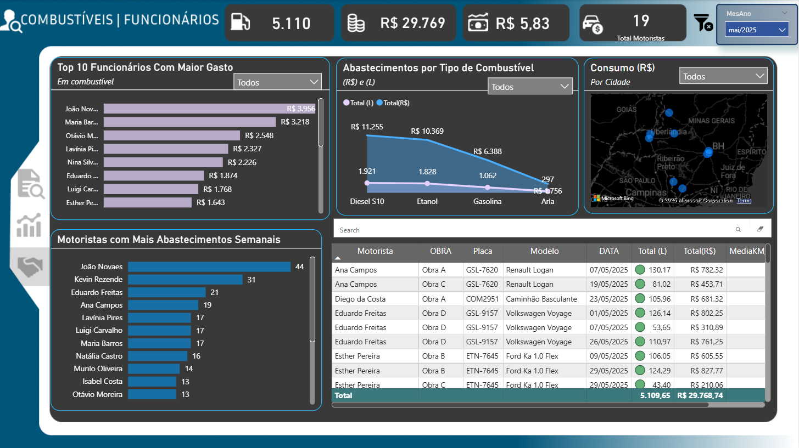

# Dashboard-controle-combustivel
Este relatório foi desenvolvido para acompanhar os custos com combustíveis em obras, por meio de dashboards interativos criados no Power BI, com base em dados fictícios (Janeiro a Maio).

A estrutura do relatório atende a uma demanda real da empresa, permitindo análises estratégicas por obra, veículo e funcionário — além de identificar padrões de consumo, variações de custo e possíveis comportamentos irregulares.

## 📊 1. Dashboard de Visão Geral
Objetivo:
Oferecer um panorama consolidado do **consumo e dos custos** com combustíveis entre janeiro e maio, com foco por obra e tipo de combustível.

Um dos pontos mais interessantes deste painel é a possibilidade de identificar padrões de consumo por região, com base na localização das obras, e entender qual tipo de combustível tem maior demanda em cada local.

Essa visão geográfica permite ações mais estratégicas, como redistribuição de veículos, controle de estoque de combustível e prevenção de desperdícios em pontos específicos.

## 🚛 2. Dashboard de Veículos
Objetivo:
Analisar o desempenho e os padrões de abastecimento dos veículos da frota.

O painel permite identificar os funcionários mais gastões por semana, inclusive segmentando por tipo de combustível. Além disso, conta com um mapa interativo que mostra os abastecimentos por cidade, um ranking das cidades com menor valor médio por litro, facilitando a localização de abastecimentos mais vantajosos, gráficos por motorista que exibem frequência semanal, variação de custo e consumo médio (km/l), e uma tabela dinâmica detalhada para rastrear informações como placa, valor, tipo de combustível, obra e estabelecimento.

## 🧍‍♂️ 3. Dashboard de Funcionários
Objetivo:
Identificar comportamentos de consumo por motorista, analisar frequência de abastecimentos e possíveis desvios.

O interessante desse painel é a possibilidade de identificar os funcionários mais gastões por semana, além de segmentar os dados por tipo de combustível utilizado, permitindo análises mais específicas e direcionadas.

Outro destaque importante é o mapa interativo, que mostra onde os abastecimentos estão ocorrendo, e o ranking de cidades com menor valor por litro, o que ajuda a identificar oportunidades de economia e padrões regionais de preço.

Também é possível acompanhar a frequência semanal de abastecimentos por motorista (de segunda a domingo), a média de km por litro abastecido, e observar variações no comportamento entre obras ou regiões. Com essas informações, o painel ajuda a promover uma gestão mais eficiente e estratégica da frota, com foco em redução de custos e melhoria no uso dos recursos.

🚀 **Click abaixo e veja meu Dashboard publicado**:  

## 🔧 Ferramentas utilizadas

- Power BI Desktop
- Excel (como fonte de dados)
- Transformações via Power Query

