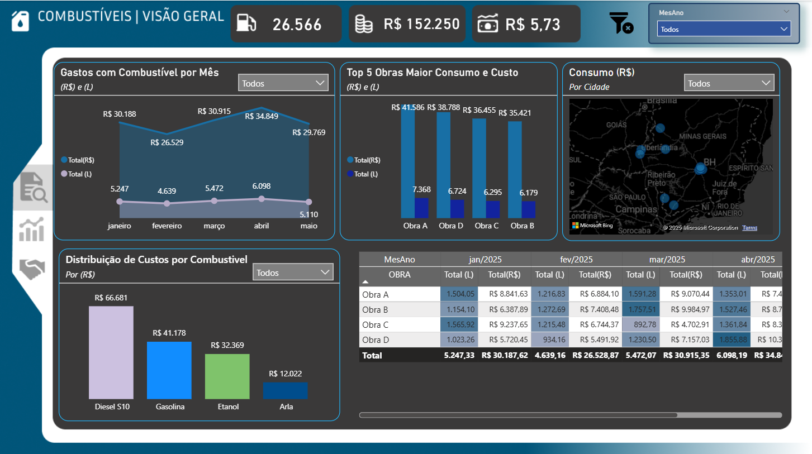
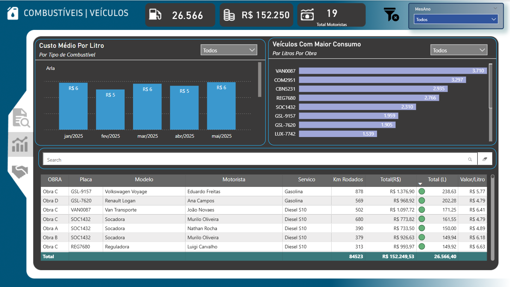
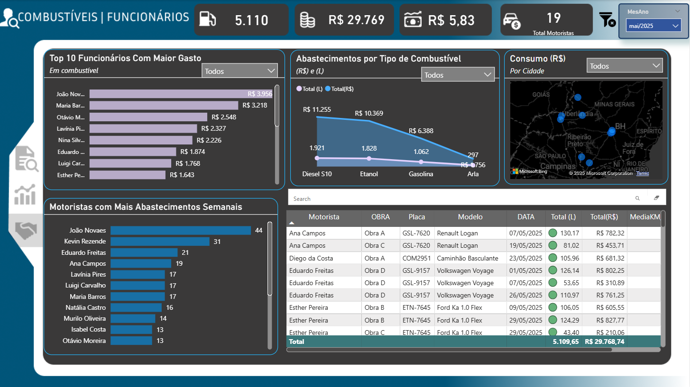

# ⛽ Dashboard de Combustiveis – Análise de Consumo e Custo
Este relatório foi desenvolvido para acompanhar os custos com combustíveis em obras, por meio de dashboards interativos criados no Power BI, com base em dados fictícios (Janeiro a Maio).

A estrutura do relatório atende a uma demanda real da empresa, permitindo análises estratégicas por obra, veículo e funcionário — além de identificar padrões de consumo, variações de custo e possíveis comportamentos irregulares.

---
## 🛠️ Tecnologias utilizadas

---

## ⚙️ Estrutura da solução

- **ETL no Power Query** com limpeza, normalização e padronização dos dados
- **Modelagem simples** com tabela única de fatos e **tabela calendário personalizada**
- Relacionamento 1:N entre a tabela de datas e a tabela de abastecimentos
- **Medidas DAX** aplicadas para:
  - Total de litros abastecidos
  - Custo total e média mensal
  - Comparativos de variação mês a mês
- **Visual desenhado no Figma** e implementado no Power BI

---

## 🖼️ Imagem dos dashboards

---
🚀 **Click abaixo e veja meu Dashboard publicado**:  

